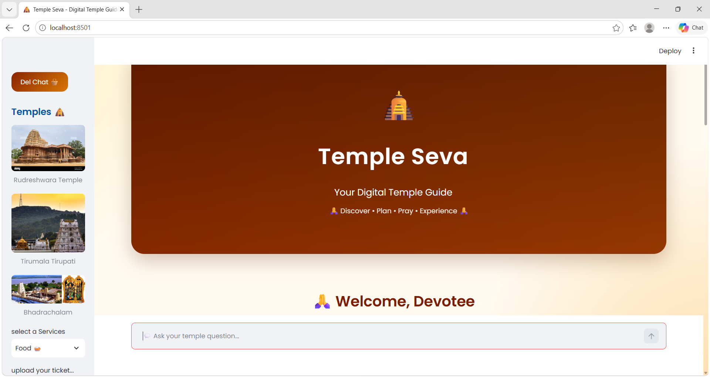
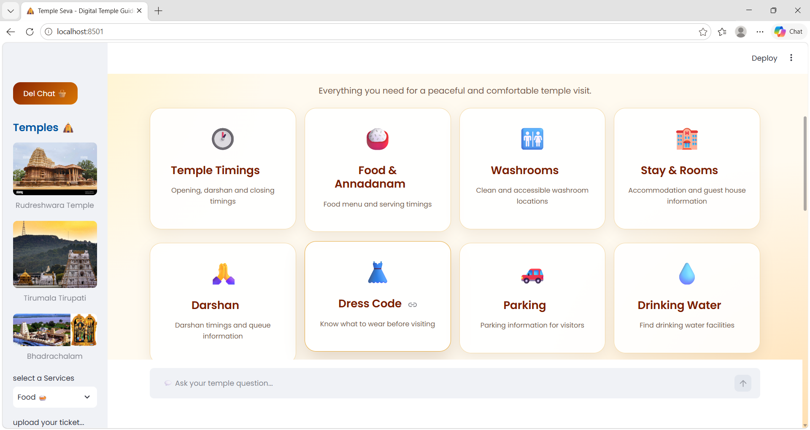
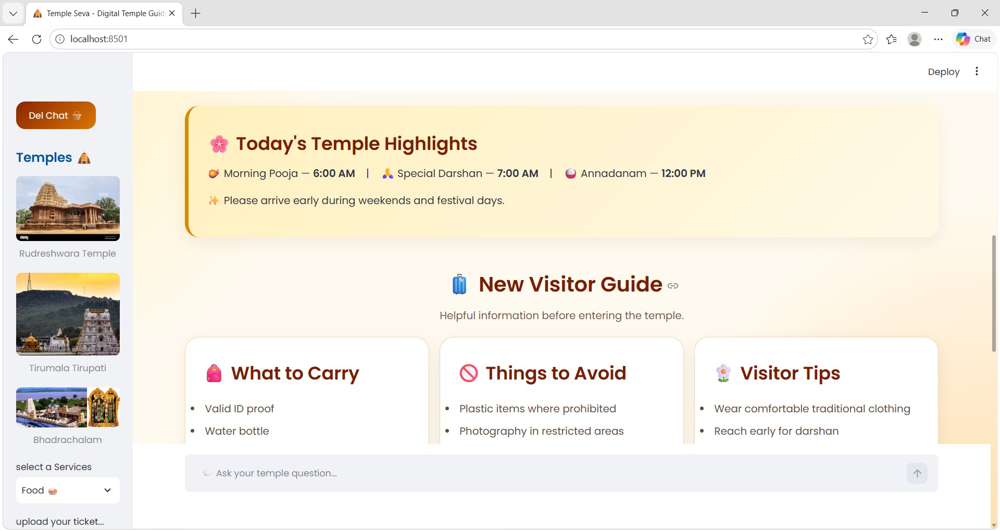
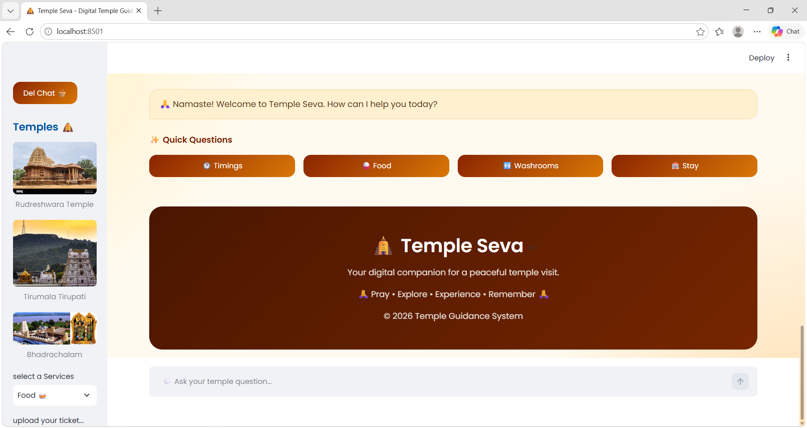

# 🛕 Temple Seva – Digital Temple Guide

Temple Seva is a **Temple Guidance Chatbot** built using **Python and Streamlit**.  
It helps new and existing temple visitors quickly find important information about the temple in one simple and attractive webpage.
# Application Screenshots





## 🌿 Project Overview

The Temple Seva application provides useful temple-related information such as:

- 🕐 Temple Timings
- 🍚 Food & Annadanam
- 🚻 Washrooms
- 🏨 Stay & Accommodation
- 🙏 Darshan Information
- 👗 Dress Code
- 🚗 Parking
- 💧 Drinking Water
- 🧭 Directions
- 🏥 Visitor Facilities
- 💬 Interactive Chatbot
- 📋 New Visitor Guide

The main goal of this project is to make temple visits easier and more convenient, especially for first-time visitors.

---

## ✨ Features

### 🕐 Temple Timings

Provides information about:

- Temple opening time
- Morning timings
- Evening timings
- Darshan timings

### 🍚 Food & Annadanam

Provides information about:

- Annadanam
- Food timings
- Meal availability

### 🚻 Washrooms

Provides information about washroom facilities available for visitors.

### 🏨 Stay & Accommodation

Provides information about:

- Guest rooms
- Accommodation
- Booking-related guidance

### 🙏 Darshan

Provides basic information about:

- Darshan
- General entry
- Special darshan
- Visitor guidance

### 👗 Dress Code

Provides temple-appropriate dress code information.

### 🚗 Parking

Provides information about:

- Parking availability
- Visitor parking
- Vehicle guidance

### 💧 Drinking Water

Provides information about drinking water facilities.

### 💬 Temple Chatbot

Visitors can ask questions using the chatbot.

Example questions:

- What are the temple timings?
- Where is the food?
- Where are the washrooms?
- Is accommodation available?
- What is the dress code?
- Where can I park?
- What facilities are available?
- How can I reach the temple?

---

## 🧑‍💻 Technologies Used

This project is developed using:

- **Python**
- **Streamlit**
- **HTML**
- **CSS**
- **Python logic for chatbot responses**

---

## 📁 Project Structure

```text
Temple-Guidance-Chatbot/
│
├── Temple.py
├── .gitignore
├── README.md
└── other project files